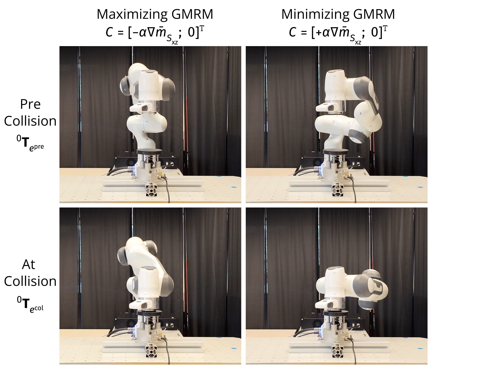
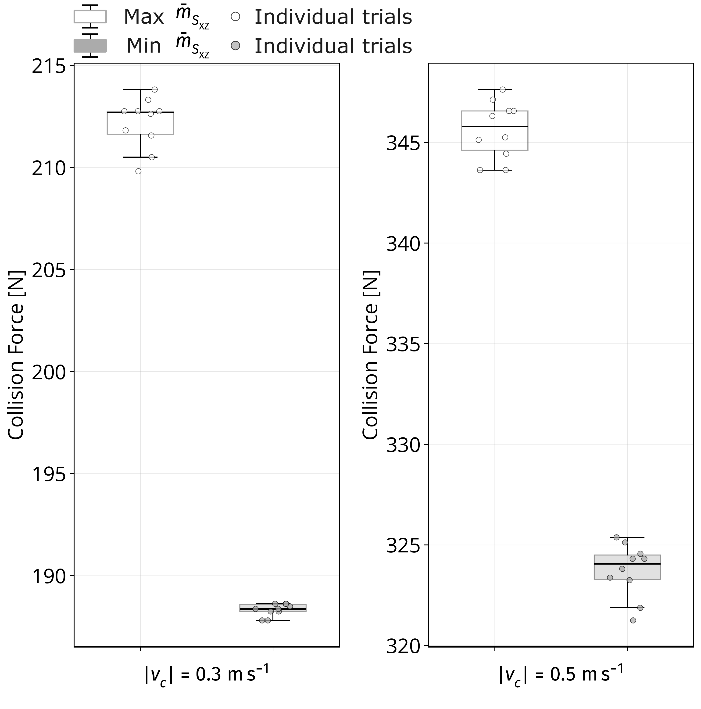

<script>
  window.MathJax = {
    tex: {
      inlineMath: [['$', '$'], ['\\(', '\\)']]
    },
    loader: {
      paths: { 'mathjax-fira': 'https://cdn.jsdelivr.net/npm/mathjax-fira-font@4.0.0-beta.7' }
    },
    output: {
      font: 'mathjax-fira'
    }
  };
</script>
<script id="MathJax-script" async
  src="https://cdn.jsdelivr.net/npm/mathjax@4/tex-mml-chtml.js">
</script>


## Contents

- [Demonstrations](#video)
- [Controller & Code](#code)
- [Getting Started](#getting-started)

---

<a id="video"></a>
## Demonstrations

Supplementary videos for Experiment 3: Motion Control and Impact Evaluation.

Each video shows the arm impacting the [Pilz Robot Measurement System (PRMS)](https://www.pilz.com/en-US/products/robotics/prms/prms) from a metric-optimal pre-collision configuration. The configuration is computed offline by the [QP controller](#code); in these clips a motion planner moves the arm to it so that all trials share a common timeline. (The online QP-driven motion is shown under [Code](#code).) Maximizing the X–Z plane GMRM $\bar{m}^{(2)}\_{s,\text{XZ}}$ produces higher collision forces than minimizing it.

<div class="figure-row">
  <figure>
    <a href="images/exp4.pdf">
      
    </a>
    <figcaption>
      Motion-control and impact experiment with $\bar{m}^{(2)}_{s,\text{XZ}}$ optimization. The left and right columns show configurations generated by maximizing and minimizing the metric, respectively. The top and bottom rows correspond to the pre-collision pose ${}^{0}\mathbf{T}_{e^{\text{pre}}}$ and the collision pose ${}^{0}\mathbf{T}_{e^{\text{col}}}$. Impact outcomes are measured by the PRMS.
    </figcaption>
  </figure>
  <figure>
    <a href="images/exp4_boxplot.pdf">
      
    </a>
    <figcaption>
      Collision-force distributions for configurations optimized to maximize and minimize $\bar{m}^{(2)}_{s,\text{XZ}}$. The left and right panels correspond to impact speeds of $|\boldsymbol{\nu}_{c}|=0.3$ and $0.5~\mathrm{m/s}$, respectively. Individual trials are overlaid. In both cases, maximizing $\bar{m}^{(2)}_{s,\text{XZ}}$ yields higher collision forces than minimizing it.
    </figcaption>
  </figure>
</div>

<div class="video-row video-row--four">
  <figure>
    <video controls>
      <source src="images/gmin0.3-cleaned-uniform.mp4" type="video/mp4">
      Your browser does not support the video tag.
    </video>
    <figcaption>
      Impact speed $|\boldsymbol{\nu}_{c}|=0.3~\mathrm{m/s}$, <strong>minimizing</strong> $\bar{m}^{(2)}_{s,\text{XZ}}$.
    </figcaption>
  </figure>
  <figure>
    <video controls>
      <source src="images/gmax0.3-cleaned-uniform.mp4" type="video/mp4">
      Your browser does not support the video tag.
    </video>
    <figcaption>
      Impact speed $|\boldsymbol{\nu}_{c}|=0.3~\mathrm{m/s}$, <strong>maximizing</strong> $\bar{m}^{(2)}_{s,\text{XZ}}$.
    </figcaption>
  </figure>
  <figure>
    <video controls>
      <source src="images/gmrm0.5min-uniform.mp4" type="video/mp4">
      Your browser does not support the video tag.
    </video>
    <figcaption>
      Impact speed $|\boldsymbol{\nu}_{c}|=0.5~\mathrm{m/s}$, <strong>minimizing</strong> $\bar{m}^{(2)}_{s,\text{XZ}}$.
    </figcaption>
  </figure>
  <figure>
    <video controls>
      <source src="images/gmrm0.5max-uniform.mp4" type="video/mp4">
      Your browser does not support the video tag.
    </video>
    <figcaption>
      Impact speed $|\boldsymbol{\nu}_{c}|=0.5~\mathrm{m/s}$, <strong>maximizing</strong> $\bar{m}^{(2)}_{s,\text{XZ}}$.
    </figcaption>
  </figure>
</div>

---

<a id="code"></a>
## Controller & Code

<div class="code-video">
  <figure>
    <video controls>
      <source src="images/panda_gmrm_qp_min.mp4" type="video/mp4">
      Your browser does not support the video tag.
    </video>
    <figcaption>
      <strong>minimizing</strong> $\bar{m}^{(2)}_{s,\text{XZ}}$.
    </figcaption>
  </figure>
  <figure>
    <video controls>
      <source src="images/panda_gmrm_qp_max.mp4" type="video/mp4">
      Your browser does not support the video tag.
    </video>
    <figcaption>
      <strong>maximizing</strong> $\bar{m}^{(2)}_{s,\text{XZ}}$.
    </figcaption>
  </figure>
</div>

These clips show the QP controller running online, resolving the arm's redundancy to increase or decrease the reflected mass while tracking the end-effector. The control loop runs at a fixed time step of $\Delta t = 0.025~\mathrm{s}$ (40 Hz).

We incorporate the reflected-mass metric into a QP controller as a secondary objective ([Nocedal & Wright, 2006](https://doi.org/10.1007/978-0-387-40065-5); [Haviland & Corke, 2021](https://arxiv.org/abs/2010.08686)):

<div class="equation">
\[
\begin{aligned}
\min_{\mathbf{x}}\quad f_o(\mathbf{x}) &= \tfrac{1}{2}\,\mathbf{x}^{\top}\mathcal{Q}\,\mathbf{x} + \mathcal{C}^{\top}\mathbf{x}, \\
\text{subject to}\quad \mathcal{J}\,\mathbf{x} &= \boldsymbol{\nu}, \\
\mathcal{X}^{-} &\leq \mathbf{x} \leq \mathcal{X}^{+},
\end{aligned}
\]
</div>

where

<div class="equation">
\[
\begin{aligned}
\mathbf{x} &= \begin{pmatrix} \dot{\mathbf{q}} \\ \boldsymbol{\delta} \end{pmatrix} \in \mathbb{R}^{n+6}, &\qquad
\mathcal{Q} &= \begin{pmatrix} \lambda_q \mathbf{I}_{n\times n} & \mathbf{0}_{n\times 6} \\ \mathbf{0}_{6\times n} & \lambda_\delta \mathbf{I}_{6\times 6} \end{pmatrix} \in \mathbb{R}^{(n+6)\times(n+6)}, \\[6pt]
\mathcal{J} &= \begin{pmatrix} \mathbf{J} & \mathbf{I}_{6\times 6} \end{pmatrix} \in \mathbb{R}^{6\times(n+6)}, &\qquad
\mathcal{C} &= \begin{pmatrix} \pm\,\alpha\,\nabla \mathrm{m}(\mathbf{q}) \\ \mathbf{0}_{6\times 1} \end{pmatrix} \in \mathbb{R}^{n+6}, \\[6pt]
\boldsymbol{\nu} &= \boldsymbol{\nu}^{*}, &\qquad
\mathcal{X}^{\pm} &= \begin{pmatrix} \dot{\mathbf{q}}^{\pm} \\ \boldsymbol{\delta}^{\pm} \end{pmatrix} \in \mathbb{R}^{n+6}.
\end{aligned}
\]
</div>

with:

- $\mathbf{x} = (\dot{\mathbf{q}}, \boldsymbol{\delta})$ — the decision variable: joint velocities and a slack vector $\boldsymbol{\delta} \in \mathbb{R}^{6}$ that preserves feasibility while tracking the desired twist $\boldsymbol{\nu}^{*}$;
- $\lambda\_q,\ \lambda\_\delta$ — weights on joint velocity and slack;
- $\mathcal{C}$ — carries the reflected-mass gradient $\nabla \mathrm{m}(\mathbf{q})$; the sign $\pm\alpha$ sets whether the metric is increased or decreased, which resolves the arm's redundancy;
- $\mathcal{X}^{\pm}$ — the joint-velocity and slack limits.

[View source](docs/qp.py)





---

<a id="getting-started"></a>
## Getting Started

Install [uv](https://docs.astral.sh/uv/getting-started/installation/), then reproduce the demo from the code repository:

```bash
git clone https://github.com/haoueei/gmrm-code.git
cd gmrm-code
uv sync --locked
```

Then run the controller demo:

```bash
uv run python main.py
```

> **Note:** The initial run may take a little while to start.
